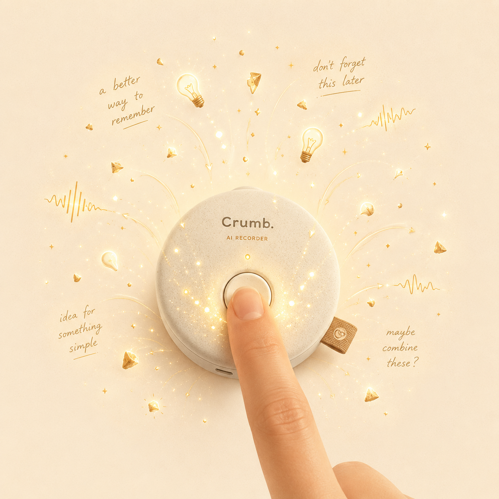
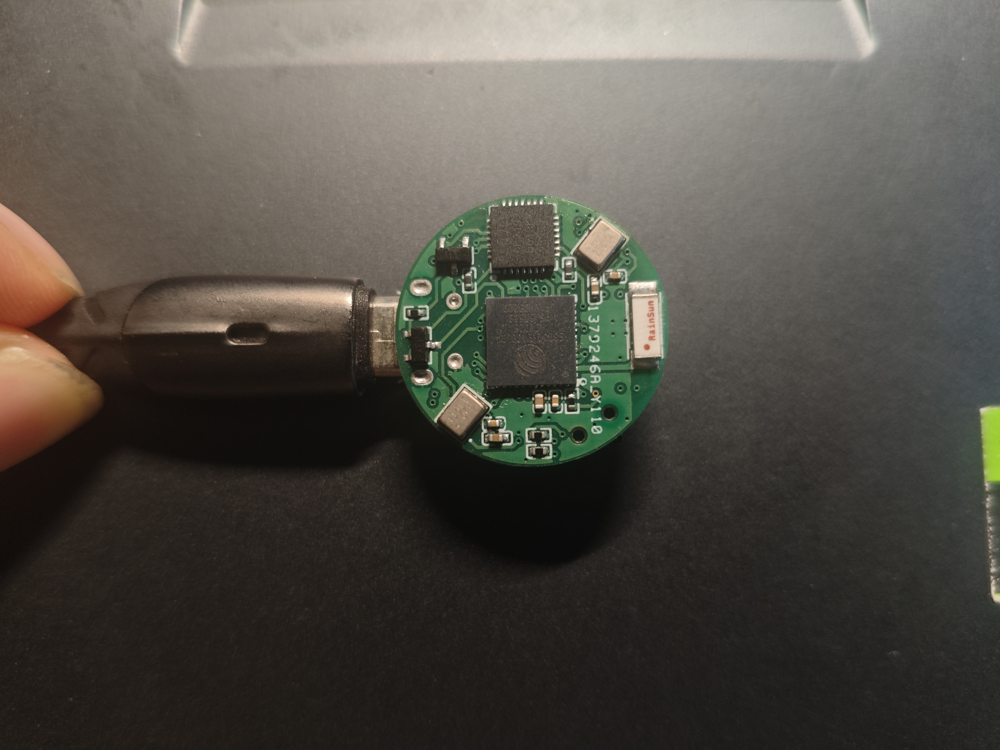
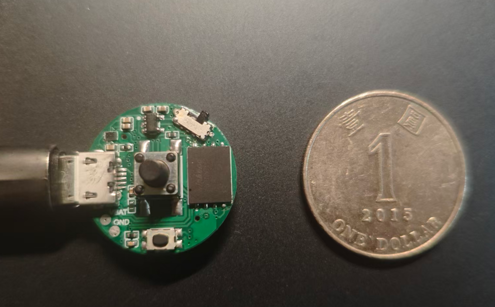

# Crumb 🍞

> **Your low-cost, tiny wearable AI recorder to pick up your crumbs.**

A *crumb* is the little piece of bread that falls away while you eat — easy to
miss, easy to lose. Your day is full of crumbs too: a passing idea, a half-heard
remark, the answer to the question you'll have tomorrow. **Crumb** picks them up.

**Pick up your crumbs during your daily research.**

Crumb is an **open source, handmade, low-cost AI recorder** — small enough to
wear, simple enough to build yourself.

<p align="center">
  
</p>

---

## What it does

Crumb is currently at **v1**: a tiny wearable AI recorder.

The flow is dead simple:

1. **Press the button.** Crumb starts capturing audio.
2. **It uploads to the cloud.** The recording is sent off the device automatically.
3. **Your server makes sense of it.** On your own personal server, the audio is
   transcribed, analyzed, and summarized — so you keep the insight, not just the
   raw sound.

You wear it, you tap it, and the things worth remembering get caught before they
fall.

## Crumb v1 hardware

The current v1 is a small, round, hand-assembled PCB — a single button to start
recording, a microphone, and Wi-Fi / BLE on board to upload what it hears. Here
it is, shown next to a micro-USB cable for scale.

<p align="center">
  
  &nbsp;&nbsp;
  
</p>

<p align="center"><sub>Crumb v1 — front (left) and back (right).</sub></p>

<p align="center">
  
</p>

<p align="center"><sub>Crumb v1 next to a coin — about the same size.</sub></p>

<p align="center"><b>Just 2.2&nbsp;cm wide — about the size of a coin, small enough to be worn.</b></p>

## Repository structure

| Directory | Description |
|-----------|-------------|
| **`hardware/`** | PCB design files for Crumb v1 — the board that makes the device. |
| **`firmware/`** | The on-device firmware. Captures audio on a button press and uploads it over Wi-Fi / BLE. |
| **`software/`** | The receiving end: server-side code that ingests recordings and turns them into transcripts and summaries. |
| **`doc/`** | Documentation and project notes. |

## Quick Start

Clone the project to get started:

```bash
git clone https://github.com/blankchenxm/crumb.git
cd crumb
```

### Software (the receiving server)

The server ingests your recordings and transcribes/summarizes them.

```bash
cd software
pip install fastapi uvicorn openai requests
```

API keys are read from environment variables — never commit them:

```bash
export SILICONFLOW_API_KEY=...   # used by server.py for transcription
export DEEPGRAM_API_KEY=...      # used by transcribe_deepgram.py
```

Run the upload + transcription server:

```bash
uvicorn server:app --host 0.0.0.0 --port 8000
```

Transcribe already-recorded clips:

```bash
python transcribe_deepgram.py --all
```

### Firmware (the device)

Flash the firmware onto your assembled Crumb board, point it at your server's
address, and you're ready to start collecting crumbs.

```bash
cd firmware/crumb_V1_esp_idf
idf.py build flash monitor
```

### Hardware (build your own)

Open the design files in `hardware/crumb_v1/` to fabricate the PCB and assemble
your own Crumb.

---

## Roadmap — Crumb v1 to-do

A living checklist of what's left for Crumb v1. Boxes get ticked as things land.

### Firmware

- [ ] Finish the v1 recording logic: name each clip by capture time; with no
  Wi-Fi, store to flash; once Wi-Fi is available, upload everything buffered in
  flash.
- [ ] On-device audio processing: average the two channels + Opus compression on
  the device, decompress in the cloud.

### Hardware

- [ ] Add a battery.
- [ ] Build a 3D-printed enclosure.
- [ ] Wear it more — find the problems that only show up during long, real-world use.

### Software

- [ ] Stand up the cloud server (targeting a Mac mini) so Crumb can upload audio
  from any Wi-Fi it connects to.
- [ ] Server-side audio pipeline: basic processing (normalization + RNNoise),
  then VAD + STT — with a focus on multilingual, offline STT.
- [ ] Three core pages:
  - [ ] **Audio** — waveform/timeline view + transcript.
  - [ ] **Project mind map** — auto-group audio per project and lay out how each
    idea evolved along a timeline.
  - [ ] **Chatbot** — chat with your ideas.

## Status

Crumb v1 is the first working version. It's handmade and evolving — feedback and
contributions are welcome.

## License

Released under the [MIT License](LICENSE).
